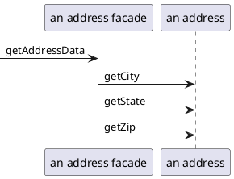

# 数据源架构模式

## 表数据入口 (Table Data GateWay)
表数据入口包含了用于访问单个表或视图的所有SQL，如选择、插入、更新、删除等。其他代码调用它的方法来实现所有与数据库的交互.

每个方法都将输入参与映射为一个SQL调用 并在数据库连接上执行该语句。由于表数据入口用于数据读写，因此通常是无状态的。

## 行数据入口 (Row Data GateWay)
充当数据源中单条记录入口的对象。每行一个对象。

## 活动记录 (Active Record)
一个对象，它包装数据库表或视图中某一行，封装数据库访问，并在这些数据上增加领域逻辑。

本质是一个领域模型

Pros
- 容易创建、易于理解

Cons
- 要求对象的设计和数据库的设计紧耦合
- 业务逻辑复杂时。

## 数据映射器(Data Mapper)

在保持对象和数据库（以及映射器本身）彼此独立的情况下，在二者之间移动数据的一个映射层。

对象和关系数据库用来组织数据的机制不同。对象的很多部分（如集合和继承）在关系数据库中不存在。

### 处理查找方法
分离接口解决这一难题：从领域对象到数据映射器的依赖关系。利用领域代码把所有需要查找方法放到一个可以置于领域包中的接口类中。

> 在一个包中定义接口，而在另一个与这个包分离的包中实现这个接口。

### 把数据映射到领域对象的域
映射器需要访问领域对象中的域（属性）。这往往是个问题，因为需要一些公共方法支持领域逻辑不需要的映射器。??? 

### 基于元数据的映射
如何将领域对象中的域映射到数据库列的信息。

- 用显式代码实现，
- 把元数据作为数据存储在类或单独的文件中。这就是元数据映射。
    - 好处是映射器的所有变化通过数据处理，而不用更多的源代码，也不用代码生成或者反射程序。

Pros
- 解耦数据库和领域对象

Cons
- 引入新的层次。

# 分布模式

## 远程模式（Remote Facade)

> 为细粒度对象提供粗粒度的外观来改进网络上的效率

**一个远程外观是一个粗粒度的外观(facade)，它建立在大量的细粒度对象之上，所以细粒度对象都没有远程接口，并且远程外观不包括领域逻辑。 远程外观所要完成功能是把粗粒度的方法转化到底层的细粒度对象上。**

在粗粒度对象和细粒度对象之间的一层薄薄的皮肤。

远程外观功能： 

- 提供一个粗粒度的接口
- 提供安全检查
- 事务控制： 开启一个事务，当做完许多工作之后提交事务。

**远程外观没有领域逻辑**

## 数据传输对象（Data Transfer Object）

> 一个为了减少方法调用次数而在进程间传输数据的对象。

# 离线并发模式
乐观离线锁， 悲观离线锁，粗粒度锁，隐含锁

# 会话状态模式

客户端会话模式、服务器会话模式、数据库会话模式

 

  ·End·  

