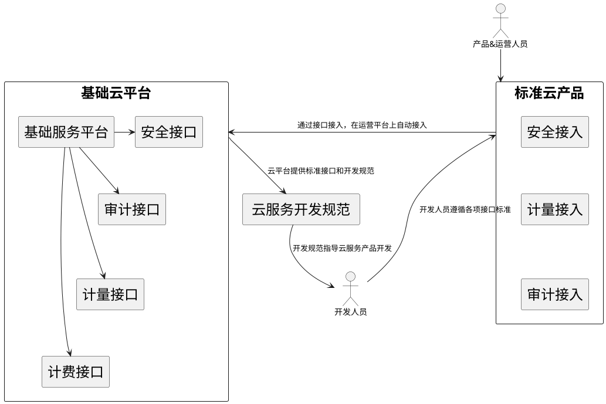
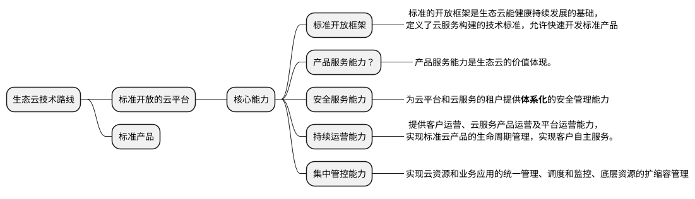

# 背景

# 我们的问题

## 效率
效率，不只是开发、测试、需求，指的是迭代上线的效率。

## 业务的价值和清晰
做有价值的业务, 并有清晰的规划   

- 缺乏严格的需求评审

# 我们的改变

## 提高效率

- 更改目前发版的流程， 不需要建版本，在发版完即可通知相关方。
- 更改目前的测试方式， 推动接口测试+单元测试， 不依赖与APP测试。
- 着力中台, 沉淀公共业务领域，提高小前台的的迭代速度
- 引入devops, 释放developer的参与的运维工作 

## 清晰的业务和价值 

- 需求流程优化
- 加强需求评审

## 应用能力平台化
### [行业对标] 金融生态云
内容来自： [银行生态云建设思路及架构参考][back-cloud-architecture]

#### 技术路线


"开放云平台+标准产品”的方式成就了**典型生态云的持续运营能力**。开放的云平台提供云基础服务，并以标准接口的方式把这些基本服务暴露给云产品开发人员。




### [行业对标] 华润集团云计算服务平台建设思路讨论
[Click PDF][huarun-cloud-build-thing] 来自甲骨文首席架构师 刘翔
#### 对云计算的NIST解释
> [NIST] 云计算是一种新的模式，基于此消费者能能够方便、按需地从网络访问到共享的可配置计算资源池（如， 网络、服务器、存储、应用程序和服务），且只需最小的管理或与服务提供方交互即可快速供应和释放这些资源。 

5个重要特征（**STEAM**)

- S**按需自助服务**
- T**多租户的资源池**
- E快速伸缩
- A广泛的网络访问
- M**按使用量收费的服务**

4种部署类型

- 公有云
- 私有云
- 社区云
- 混合云

3种服务模式

- SaaS 
- PaaS
- IaaS

## 物联网平台化 - IoT
这块知识是2020年需要成长的地方，硬件为主，赋能硬件是后续的趋势。 

### 架构是怎样的？ 

案例/论文参考： 

[Lambda architecture](https://en.wikipedia.org/wiki/Lambda_architecture) a data-processing architecture designed to handle massive quantities of data by take advantage of both batch and stream-processing methods. 

[A Distributed Stream Processing based Architecture for IoT Smart Grids Monitoring .pdf](https://www.researchgate.net/publication/321639779_A_Distributed_Stream_Processing_based_Architecture_for_IoT_Smart_Grids_Monitoring)

 - Cyclic Architecture
    - Messaging Layer 
    - Processing Layer
    - Volatile Layer

[Applying the Kappa architecture in the telco industry](https://www.oreilly.com/content/applying-the-kappa-architecture-in-the-telco-industry/) 


[Stream IoT data to an autonomous database using serverless functions](https://docs.oracle.com/en/solutions/iot-streaming-oci/index.html#GUID-BAE48036-286B-49CE-A6AA-5870CAD689D2)


参考： [Architecture Patterns for IoT](https://medium.com/@prashunjaveri) 


### [行业对标] Google Cloud IOT

参考下面服务组件和数据流图: [Cloud IoT Core](https://cloud.google.com/iot/resources/cloud-iot-overview3.png?hl=zh_CN)

#### 名词解释
|  名词 | 解释 |
| --- | --- |
| device registry | a container of devices with shared properties |
| device | a "Thing" in "Internet of Things"; a processing unit that is capable of connecting to the internet (directly or indirectly) and exchanging data with the cloud.|
#### 实践
如下内容来自[Google IoT Core 指南][google-iot-core]

- Install Google Cloud SDK
- Create devices registries 
    - Create a device registry
    - IAM role for Pub/Sub publishing
- Creating device key pairs
    - First `create a pulbic/private key pair`
    - When connecting to Cloud IoT Core, each device creates a `JSON Web Token(JWT)` signed with its private key, which Cloud IoT Core authenticate using the device's pulbic key
        - Cloud IoT Core can verify device public key certifcates against registry-level CA certificates? 用注册的CA证书验证设备公钥证书
        - 作用：a verified cerficate attests that a `public/private key pair` belongs to a legitimate device. 当设备生产商创建公私钥后，私钥存储在设备中，而公钥被CA签名。 
        - 设备注册有CA证书时，那么只接受CA签名过公钥设备. 当平台需要兼容多种设备时，可以让设备添加到响应的设备注册里，不至于混乱添加，导致设备收到异常指令或者上报错误的信息。
- Creating or editing a device
  - 创建设备时`身份验证`可以选择公钥的格式。
      - 公钥 (RS256 或 ES256)
      - 公钥证书（被CA签名过的）

```plantuml
@startuml
!include <awslib/AWSCommon>
!include <awslib/General/Client>
!include <awslib/Mobile/APIGateway>

Client(device, drone, "")
APIGateway(api, "IoT Broker", "")

device -> api: 使用JWT认证方式\n以mqtt协议接入
@enduml

```

### [行业对标] 阿里云 IOT
#### 实践
*TODO*

### [行业对标] EMQ X

1. 关键技术
    - 分布式
    - 容器化
    - 桥接
2. 核心指标
    - 多协议
    - 并发量： 单服务器200万并发, 一个集群1000万并发(7个节点）
    - 吞吐量： 单集成百万并发

#### 实践
*TODO*

### [行业对标] Azure IoT

**[Azure IoT reference architecture](https://docs.microsoft.com/zh-cn/azure/architecture/reference-architectures/iot)** show a recommended architecture for IoT applications on Azure using PaaS(platform-as-a-service) components


#### two way to process telemetry data: 
- hot path
    - the **hot  path** analyzes data in near-real-time, as it arrives, In the hot path, telemetry must be processed with very low latency. The hot path is typically implemented using a stream processing engine(Azure Stream Analytics or **Apache Spark**). The output may trigger an alert, or be written to a structured format that can be queried using analytical tools.
- code path
    - The **cold path** performs batch processing at longer intervals(hourly or daily).

#### Data Storage 
For cold path storage, Azure Blob Storage is the most cost-effective option 

For warm path storage, consider using Azure Cosmos DB.


#### 解决方案 

**[Publish and subscribe with Azure IoT Edge](https://docs.microsoft.com/zh-cn/azure/iot-edge/how-to-publish-subscribe?view=iotedge-2020-11#authorization)** Azure IoT 如何解决 Topic pub/sub 权限的问题。


**[Real Time Analytics on Big Data Architecure](https://docs.microsoft.com/en-us/azure/architecture/solution-ideas/articles/real-time-analytics)** Get insights form live streaming data with ease. 


**[Advanced Analytics Architecture](https://docs.microsoft.com/en-us/azure/architecture/solution-ideas/articles/advanced-analytics-on-big-data)** Transform your data into actionable insights using the best-in-class machine learning tools. This architecture allows you to combine any data at any scale, and to build and deploy custom machine learning models at scale.


**[Ingesting, processing and visualizing real-time vehichle data](https://docs.microsoft.com/zh-cn/azure/architecture/example-scenario/data/realtime-analytics-vehicle-iot)** 


**[国外物联网平台初探（二） ——微软Azure IoT](https://blog.csdn.net/u011596455/article/details/77925246)** 平台定位: 连接设备、其它 M2M 资产和人员，以便在业务和操作中更好地利用数据

*[点击查看图片](http://images2015.cnblogs.com/blog/43267/201609/43267-20160907162226973-62747760.png)* 


## 解决方案 

### 我们关心什么需求

- 性能 (Performance)
    - MST, Maximum sustainable throughout
    - Lantacy
- 可伸缩性 (Scalability）
    - Maximun number of supported concurrent connections
    - The time to start a new broker
- 韧性/可用性 (Resilience)
    - The message loss count in case of a broker instance crashing 
- 安全 (Security)
    - only a side-aspect of security and
measures the overhead of enabled TLS encryption on the maximum sustainable
throughput (as percentage).
- 可扩展性 (Extensibility)
    - offers plug-in mechanisms 
- 易用性 (Usability)

### 选择
EMQ X


# 参考
1. MQTT ESSENTIALS by HIVEMQ团队整理 https://www.hivemq.com/mqtt-essentials/ 
    - MQTT Basic
    - MQTT Features
    - MQTT Specials
2. 初识MQTT https://developer.ibm.com/zh/articles/iot-mqtt-why-good-for-iot/ 
    - 为什么是MQTT而不是其他协议
    - MQTT协议是怎样的

3. EMQ X https://github.com/emqx/emqx

4. NATS 
    - Does NATS support MQTT? https://github.com/nats-io/nats-server/issues/812
        - 分支开发中，预计在Q4支持
    - 支持持久化存储 File Store / SQL Store [Persistence][nats-persistence]
  

5.  Comparison of MQTT Brokers for Distributed IoT Edge Computing [[pdf]](http://www.koziolek.de/docs/Koziolek2020-ECSA-preprint.pdf)


[nats-persistence]: https://docs.nats.io/nats-streaming-server/configuring/persistence
<br>

[back-cloud-architecture]: https://cloud.tencent.com/developer/article/1485632

[huarun-cloud-build-thing]: https://www.oracle.com/technetwork/cn/community/developer-day/10-cloud-computing-platform-1863872-zhs.pdf

[google-iot-core]: https://cloud.google.com/iot/docs/how-tos/devices?hl=zh_CN
<center>  ·End·  </center>
