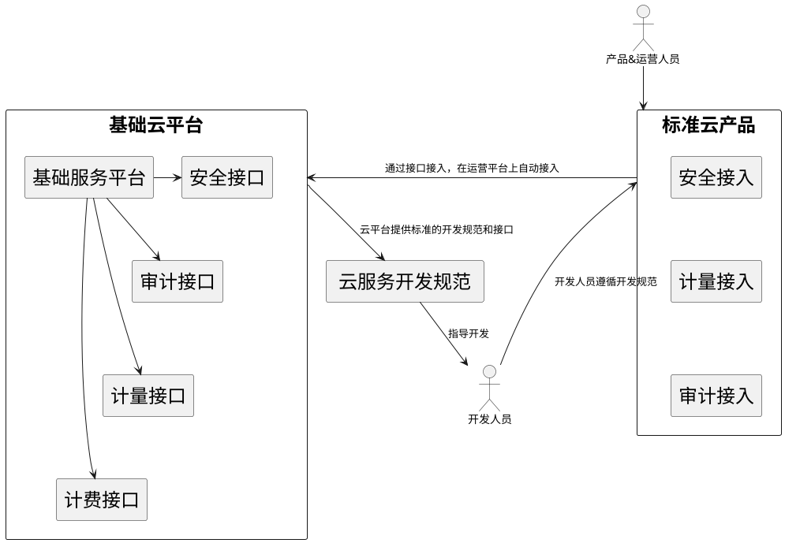
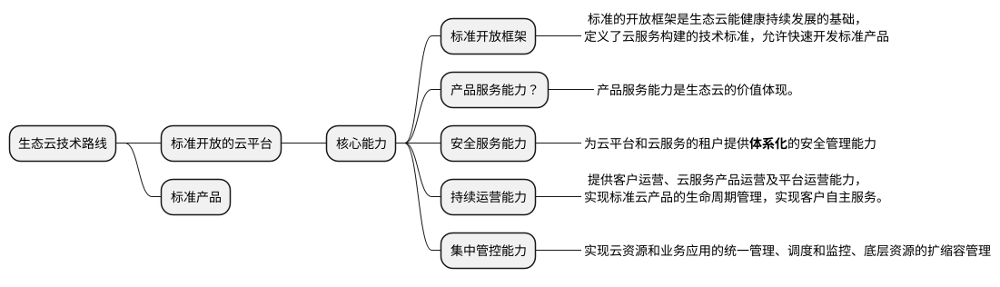

# 背景

# 我们的问题

## 效率
效率，不只是开发、测试、需求，指的是迭代上线的效率。

## 业务的价值和清晰
做有价值的业务, 并有清晰的规划   

- 缺乏严格的需求评审

# 我们的改变

## 提高效率

- 更改目前发版的流程， 不需要建版本，在发版完即可通知相关方。
- 更改目前的测试方式， 推动接口测试+单元测试， 不依赖与APP测试。
- 着力中台, 沉淀公共业务领域，提高小前台的的迭代速度
- 引入devops, 释放developer的参与的运维工作 

## 清晰的业务和价值 

- 需求流程优化
- 加强需求评审

## 应用能力平台化
### [行业对标] 金融生态云
内容来自： [银行生态云建设思路及架构参考][back-cloud-architecture]

#### 技术路线

"开放云平台+标准产品”的方式成就了**典型生态云的持续运营能力**。开放的云平台提供云基础服务，并以标准接口的方式把这些基本服务暴露给云产品开发人员。

## 物联网平台化 - IoT
这块知识是2020年需要成长的地方，硬件为主，赋能硬件是后续的趋势。 

### [行业对标] Google Cloud IOT
#### 实践
### 阿里云 IOT
#### 实践

### [行业对标] EMQ X

1. 关键技术
    - 分布式
    - 容器化
    - 桥接
2. 核心指标
    - 多协议
    - 并发量： 单服务器200万并发, 一个集群1000万并发(7个节点）
    - 吞吐量： 单集成百万并发

#### 实践

## 解决方案 
明星产品, 比如xxx

新产品设备?
# 参考
1. MQTT ESSENTIALS by HIVEMQ团队整理 https://www.hivemq.com/mqtt-essentials/ 
    - MQTT Basic
    - MQTT Features
    - MQTT Specials
2. 初识MQTT https://developer.ibm.com/zh/articles/iot-mqtt-why-good-for-iot/ 
    - 为什么是MQTT而不是其他协议
    - MQTT协议是怎样的

3. EMQ X https://github.com/emqx/emqx

4. NATS 
    - Does NATS support MQTT? https://github.com/nats-io/nats-server/issues/812
        - 分支开发中，预计在Q4支持
    - 支持持久化存储 File Store / SQL Store [Persistence][nats-persistence]
  

[nats-persistence]: https://docs.nats.io/nats-streaming-server/configuring/persistence
 

[back-cloud-architecture]: https://cloud.tencent.com/developer/article/1485632

  ·End·  

