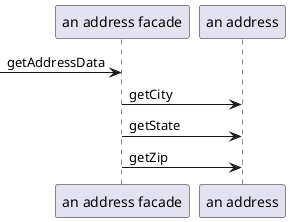

## 数据源架构模式

### 表数据入口 (Table Data GateWay)
表数据入口包含了用于访问单个表或视图的所有SQL，如选择、插入、更新、删除等。其他代码调用它的方法来实现所有与数据库的交互.

每个方法都将输入参与映射为一个SQL调用 并在数据库连接上执行该语句。由于表数据入口用于数据读写，因此通常是无状态的。

### 行数据入口 (Row Data GateWay)
充当数据源中单条记录入口的对象。每行一个对象。

### 活动记录 (Active Record)
一个对象，它包装数据库表或视图中某一行，封装数据库访问，并在这些数据上增加领域逻辑。

本质是一个领域模型

Pros
- 容易创建、易于理解

Cons
- 要求对象的设计和数据库的设计紧耦合
- 业务逻辑复杂时。

### 数据映射器(Data Mapper)

在保持对象和数据库（以及映射器本身）彼此独立的情况下，在二者之间移动数据的一个映射层。

对象和关系数据库用来组织数据的机制不同。对象的很多部分（如集合和继承）在关系数据库中不存在。

#### 处理查找方法
分离接口解决这一难题：从领域对象到数据映射器的依赖关系。利用领域代码把所有需要查找方法放到一个可以置于领域包中的接口类中。

> 在一个包中定义接口，而在另一个与这个包分离的包中实现这个接口。

#### 把数据映射到领域对象的域
映射器需要访问领域对象中的域（属性）。这往往是个问题，因为需要一些公共方法支持领域逻辑不需要的映射器。??? 

#### 基于元数据的映射
如何将领域对象中的域映射到数据库列的信息。

- 用显式代码实现，
- 把元数据作为数据存储在类或单独的文件中。这就是元数据映射。
    - 好处是映射器的所有变化通过数据处理，而不用更多的源代码，也不用代码生成或者反射程序。

Pros
- 解耦数据库和领域对象

Cons
- 引入新的层次。

## 分布模式

### 远程模式（Remote Facade)

> 为细粒度对象提供粗粒度的外观来改进网络上的效率

**一个远程外观是一个粗粒度的外观(facade)，它建立在大量的细粒度对象之上，所以细粒度对象都没有远程接口，并且远程外观不包括领域逻辑。 远程外观所要完成功能是把粗粒度的方法转化到底层的细粒度对象上。**

在粗粒度对象和细粒度对象之间的一层薄薄的皮肤。

远程外观功能： 

- 提供一个粗粒度的接口
- 提供安全检查
- 事务控制： 开启一个事务，当做完许多工作之后提交事务。

**远程外观没有领域逻辑**

### 数据传输对象（Data Transfer Object）

> 一个为了减少方法调用次数而在进程间传输数据的对象。

数据传输对象的价值在于它允许你在一次调用中传输几部分的信息。

数据传输对象通常不仅仅包含一个服务器对象。

通常不能从领域模型中传输对象。原因有：

- 对象常常在复杂的 web 中连接起来，并且能够序列化的话也很难
- 你通常还不想在客户端看到领域对象类， 应该从领域对象中传输一个简单格式的数据。

数据传输对象的常见格式有 

- 记录集， 它是一系列的表格记录。
- 集合数据结构

#### 使用时机

1. 当你需要在一个方法调用中在两个进程之间传输多个数据项，应使用数据传输对象模式。
2. 做为不同软件层中各种组件的通用数据源

####  FAQ 

1. 是用单一数据传输对象来处理整个交互，还是用不同的数据传输对象来处理不同的请求。

2. 是为请求房和发送方各自准备一个数据传输对象，还是用一个单一的数据传输对象来负责交付。

## 离线并发模式
乐观离线锁， 悲观离线锁，粗粒度锁，隐含锁

### 乐观离线锁
通过检查在会话读取一条记录后，没有其他的会话修改该数据来保证数据的一致性。

### 悲观离线锁

> 每次只允许一个业务事务访问数据以防止并发业务事务中的冲突

#### 运用机制
通过 3 步来实现悲观离线锁： 决定需要使用哪种锁类型，构建一个锁管理对象，定义业务事务使用锁的过程。

锁类型有：

- exclusive write lock 独占写锁
- exclusive read lock 独占读锁
- read / write lock 读写锁

## 分布式锁
分布式环境下锁的全局唯一资源，使请求串行化，实际表现互斥锁，解决业务幂等问题。

强一致性、服务本身高可用使最基本的需求，其他的比如支持自动续费，自动释放机制，高度抽象接入简单，可视化，可管理等。

- 基于 Redis 缓存的分布式锁[1]
    - 存在单点**问题**，一旦涉及到 redis 集群，就会出现重复加锁的情况。
    - 基于超时时间无法续租**问题**，随机数(fencing token[2])解决了锁被其他任务释放的问题，但是还是无法解决超时导致的锁释放的问题。**Redission** 采用了 `Watch dog` 模式来解决这个问题的，具体是后台开启一个线程，每隔一定的时间去检查该锁 还有多久超时，然后给这个锁进行续租。
    - 异步主从同步**问题**
- 基于存储层的可靠的解决方案，比如 zookeeper / ETCD

## 会话状态模式

客户端会话模式、服务器会话模式、数据库会话模式

当服务器会话状态也需要持久化时， 服务器会话状态和数据库会话状态之间区别是： **是否将服务器会话状态中的数据转化为表格形式。**

## 参考

[1] Somersames: [Redis 实现的分布式锁是完美的吗？](https://somersames.xyz/2020/08/03/Redis%E5%AE%9E%E7%8E%B0%E7%9A%84%E5%88%86%E5%B8%83%E5%BC%8F%E9%94%81%E6%98%AF%E5%AE%8C%E7%BE%8E%E7%9A%84%E5%90%97%EF%BC%9F/)

[2] Martin Kleppmann: [How to do distributed locking](https://martin.kleppmann.com/2016/02/08/how-to-do-distributed-locking.html)

 

  ·End·  

